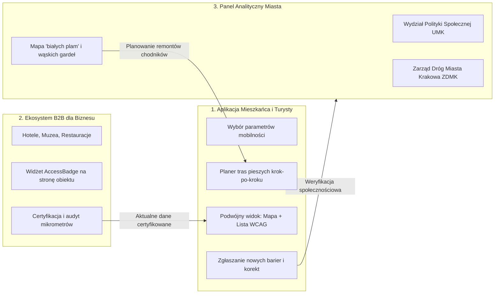

# Idea i Koncepcja Projektu: Kraków Bez Barier (AccessKraków)

> **„Dostępność nie jest cechą samego budynku czy chodnika. Dostępność to relacja pomiędzy indywidualnymi możliwościami człowieka a fizycznymi parametrami otoczenia.”**

Niniejszy dokument opisuje genezę, filozofię projektową, docelowe funkcjonowanie oraz długofalową wizję platformy **Kraków Bez Barier (AccessKraków)**, stworzonej w ramach wyzwania miejskiego dla Miasta Krakowa.

---

## 1. Geneza i Zdefiniowany Problem

### 1.1. Pułapka binarnego podziału („Dostępne” vs „Niedostępne”)
Tradycyjne mapy i miejskie przewodniki stosują uproszczone oznaczenia w postaci zielonej ikony wózka lub etykiety „obiekt dostępny”. W rzeczywistości informacja ta jest często bezużyteczna lub wręcz niebezpieczna:
- Obiekt z rampą o stromym nachyleniu (np. 12%) jest nie do pokonania dla osoby na wózku manualnym, ale bez problemu wjedzie tam wózek elektryczny.
- Restauracja z płaskim wejściem, ale drzwiami o szerokości 75 cm, wyklucza szerokie wózki inwalidzkie czy bliźniacze wózki dziecięce, lecz jest idealna dla turysty z walizką.
- Zabytkowy bruk (tzw. „kocie łby”) na ul. Kanoniczej pod Wawelem nie stanowi przeszkody architektonicznej w postaci schodów, ale generuje drgania wykluczające osoby po urazach kręgosłupa i niszczy kółka walizek podróżnych.

### 1.2. Problem fałszywego poczucia bezpieczeństwa
Większość agregatorów danych traktuje **brak informacji o przeszkodzie jako brak przeszkody**. Jeżeli w bazie OpenStreetMap brakuje tagu o stopniach, systemy nawigacji prowadzą użytkownika wprost na schody. 

### 1.3. Ochrona prywatności i unikanie stygmatyzacji (Privacy by Design / RODO)
Wiele dotychczasowych prób cyfryzacji dostępności wymagało od użytkownika deklarowania rodzaju niepełnosprawności, stopnia orzeczenia lub chorób. Jest to sprzeczne z art. 9 RODO (dane wrażliwe o stanie zdrowia) i budzi uzasadniony opór psychologiczny.

---

## 2. Główna Idea Rozwiązania (The Core Idea)

Platforma **AccessKraków** redefiniuje pojęcie dostępności miejskiej w oparciu o cztery filary:

```
┌────────────────────────────────────────────────────────────────────────┐
│                        KRAKÓW BEZ BARIER                               │
│                                                                        │
│   1. Parametry, nie etykiety   → Konkretne wymiary i nawierzchnie     │
│   2. Prawdomówność danych      → Brak danych != Dostępne (Ostrzeżenia) │
│   3. Etyka i Prywatność        → Zero pytań o stan zdrowia             │
│   4. Uniwersalność dla każdego → Wózki, walizki, spacerówki, seniorzy  │
└────────────────────────────────────────────────────────────────────────┘
```

1. **Przejście na parametryczność**: Aplikacja operuje na twardych danych technicznych:
   - Dokładna liczba stopni wejściowych (np. 0, 1, 3).
   - Wysokość krawężnika / progu w centymetrach.
   - Rzeczywista szerokość prześwitu drzwi wejściowych w centymetrach.
   - Kąt nachylenia podjazdu / rampy w procentach.
   - Rodzaj i struktura nawierzchni (`asfalt`, `płyty chodnikowe`, `gładka kostka`, `kocie łby`, `szuter`).
   - Szczegółowe wyposażenie toalety (przestrzeń manewrowa $\ge 150\text{ cm}$, poręcze, instalacja SOS).
   - Wymiary kabiny windy i obecność udogodnień sensorycznych (Braille, komunikaty głosowe).

2. **Zasada jawności luk danych (Transparent Data Gaps)**:
   Jeżeli obiekt nie posiada zweryfikowanych pomiarów wejścia lub toalety, system **nie przypisuje mu domyślnej dostępności**. Wyświetla jaskrawe, pulsujące ostrzeżenie: *„Luki w danych architektonicznych – zalecany kontakt przed wizytą”*.

3. **Prywatność i model funkcjonalny**:
   Zamiast pytać: *„Jaka jest Twoja niepełnosprawność?”*, system pyta: *„Jaki próg jesteś w stanie pokonać i jakiej szerokości drzwi potrzebujesz?”*. Użytkownik korzysta z szybkich presetów lub suwaków, a dane nie opuszczają jego przeglądarki.

---

## 3. Grupy Docelowe i Korzyści

Rozwiązanie projektowano z myślą o szerokim przekroju użytkowników przestrzeni publicznej:

| Grupa docelowa | Kluczowe potrzeby i wyzwania | Co zyskuje w AccessKraków? |
| :--- | :--- | :--- |
| **Osoby na wózkach manualnych** | Unikanie schodów bez ramp, kontrola stromizny podjazdów ($\le 6-8\%$), obniżone krawężniki. | Pewność samodzielnego wjazdu, eliminacja niespodzianek w postaci pojedynczych progów 15 cm. |
| **Osoby na wózkach elektrycznych** | Szerokie przejścia ($\ge 85-90\text{ cm}$), odpowiednie wymiary kabiny windy ($\ge 110\times 140\text{ cm}$). | Szczegółowe metryczki wind i drzwi przed podjęciem trasy. |
| **Turyści z ciężkimi walizkami** | Unikanie zabytkowego bruku („kocich łbów”), winda na dworcu, równe nawierzchnie na trasie do hotelu. | Planer tras omijający wyboiste uliczki na rzecz gładkich alejek Plant Krakowskich. |
| **Rodzice z wózkami dziecięcymi** | Płaskie zjazdy, bezstopniowy dostęp do parków i muzeów, przewijaki i ławki do karmienia/odpoczynku. | Wyszukiwanie miejsc wytchnienia (ławki z oparciem) i tras spacerowych bez schodów. |
| **Seniorzy i osoby o kulach** | Regularne miejsca odpoczynku (ławki co 50 m), poręcze przy stopniach, unikanie śliskich i nierównych nawierzchni. | Informacja o obecności poręczy, odległościach i ławkach w bezpośrednim otoczeniu. |

---

## 4. Docelowy Model Działania Systemu (End-to-End)

W pełnej wersji wdrożeniowej ekosystem AccessKraków składa się z trzech współpracujących ze sobą filarów:



### 4.1. Ścieżka użytkownika (User Journey):
1. **Definicja profilu (1 kliknięcie)**: Użytkownik wybiera profil (np. *Turysta z walizką*) lub dostosowuje suwaki parametrów.
2. **Eksploracja i wyszukiwanie**: Wpisanie nazwy (np. *Sukiennice*) lub kategorii (np. *Muzea*). System w czasie rzeczywistym przelicza poziom dopasowania ($0-100\%$) i sortuje obiekty, wyróżniając te z oficjalnym audytem.
3. **Wybór widoku**: Osoby widzące korzystają z interaktywnej mapy z kolorowymi pinezkami; osoby z dysfunkcją wzroku lub preferujące prostotę korzystają z dostępnej listy tekstowej (WCAG 2.2 AA).
4. **Weryfikacja parametrów**: Otwarcie karty obiektu daje natychmiastowy wgląd w: wymiary drzwi, rodzaj nawierzchni, obecność toalety, datę audytu oraz imię/nazwę podmiotu weryfikującego.
5. **Nawigacja trasą**: Wybór punktu docelowego uruchamia planer tras analizujący strukturę nawierzchni (ile procent trasy stanowi gładki asfalt, a ile bruk) oraz wykaz barier na każdym z odcinków.
6. **Sprzężenie zwrotne (Crowdsourcing)**: W przypadku napotkania nowej bariery (np. zepsuta winda, remont chodnika), użytkownik jednym kliknięciem przesyła korektę do moderacji.

---

## 5. Wiarygodność Danych – Piramida Zaufania

Kluczowym elementem wyróżniającym projekt jest **Piramida Wiarygodności**:

1. **Poziom 1: VERIFIED_OFFICIAL (100% zaufania)**
   - Pomiary wykonane podczas oficjalnych deklaracji dostępności UMK lub bezpośrednio przez certyfikowanych audytorów zarządcy obiektu.
   - Ważność: 12 miesięcy (wymóg corocznego potwierdzenia).
2. **Poziom 2: VERIFIED_COMMUNITY (80% zaufania)**
   - Informacje zgłoszone i niezależnie potwierdzone przez minimum 3 różnych użytkowników lub certyfikowaną organizację pozarządową (np. Fundację Aktywnych).
3. **Poziom 3: OPEN_DATA_IMPORT (60% zaufania)**
   - Dane zaimportowane automatycznie z OpenStreetMap i miejskich rejestrów otwartych danych. Wskazują orientacyjny stan, ale nie posiadają świeżej weryfikacji pomiarowej.
4. **Poziom 4: UNVERIFIED_REPORT (<50% zaufania)**
   - Pojedyncze, świeże zgłoszenie użytkownika z poziomu aplikacji. Oznaczone trójkątem ostrzegawczym do momentu weryfikacji.
5. **Stan DATA_GAP (Brak potwierdzenia)**
   - Obiekt z kluczowymi lukami informacyjnymi. System jawnie ostrzega użytkownika przed ryzykiem napotkania bariery.

---

## 6. Model Biznesowy i Potencjał Rozwoju (20% Wyceny Konkursowej)

Projekt nie kończy się na etapie hackathonu – posiada dopracowany plan komercjalizacji i samofinansowania poza infrastrukturą miejską:

### 6.1. Usługa B2B: Widżet i Certyfikat „AccessBadge” (Model SaaS)
- **Problem biznesowy**: Hotele, restauracje i muzea tracą zamożnych turystów o ograniczonej mobilności (np. seniorów z Europy Zachodniej), ponieważ goście boją się rezerwować nocleg bez pewności co do szerokości windy i prysznica.
- **Produkt**: Interaktywny widżet JavaScript do wklejenia na stronę internetową hotelu/obiektu z certyfikowanym audytem dostępności.
- **Model cenowy**: Abonament roczny (49 zł/mies. dla małych lokali gastronomicznych, 199–499 zł/mies. dla hoteli i centrów konferencyjnych).

### 6.2. Usługa B2B API dla Platform Rezerwacyjnych
- Udostępnianie ustrukturyzowanych danych o mikrodostępności dla globalnych platform turystycznych (Booking.com, Airbnb, portale biletowe i kongresowe).

### 6.3. Partnerstwo B2G (Miasto i Mieszkańcy)
- Udostępnienie panelu analitycznego dla Zarządu Dróg Miasta Krakowa (ZDMK) wskazującego, w których miejscach obniżenie pojedynczego krawężnika odblokuje ciągłość całej trasy spacerowej.

---

## 7. Skalowalność na Inne Miasta

Platforma została zaprojektowana w architekturze modułowej:
1. **Baza na standardzie OpenStreetMap**: Model danych jest w 100% zbieżny z globalnym formatem OSM (tagi `wheelchair`, `kerb`, `step_count`, `surface`).
2. **Dodanie nowego miasta (np. Wrocław, Gdańsk, Warszawa, Praga)**:
   - Wymaga jedynie zdefiniowania współrzędnych geograficznych nowego obszaru oraz podpięcia lokalnego portalu danych publicznych.
   - Czas uruchomienia instancji dla kolejnego miasta wynosi **poniżej 48 godzin**.

---

## 8. Podsumowanie

**Kraków Bez Barier (AccessKraków)** to nowoczesna, etyczna i społecznie odpowiedzialna platforma technologiczna. Łączy zaawansowaną analizę parametrów technicznych z prostotą obsługi i pełną dostępnością cyfrową WCAG 2.2 AA. 

Daje mieszkańcom i turystom to, co najważniejsze: **niezależność, godność i pewność bezpiecznego poruszania się po Krakowie.**
